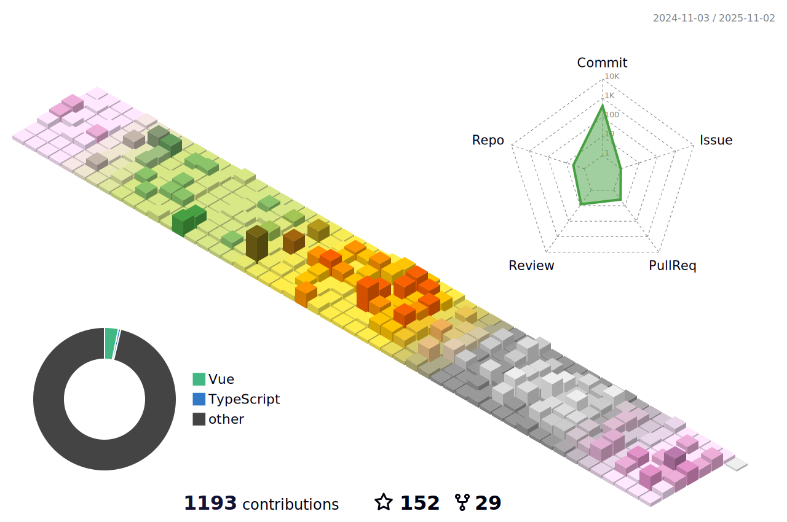

<h1 align="center">  </h1>

<!-- 个人资料徽标 -->

  &emsp;
  &emsp;
  &emsp;
  &emsp;  
  &emsp;
<!-- 访客数统计徽标 -->
  
 

:heart: Recommend

  
      

🧰 Tools:

&emsp;&emsp; 

<!-- Gif -->

  
  
  
  
  
  
  

<!-- just img -->

<table align="center">
  <tr>
    <td width="50%">
     
    </td>
    <td width="50%">
     
     
     
     
     
  

    </td>
  </tr>
</table>

<!-- GitHub Activity Graph -->
<table align="center">
  <tr>
    <td colspan="2">
      
    </td>
  </tr>
</table>

<!-- Wakatime Graph-->

  

